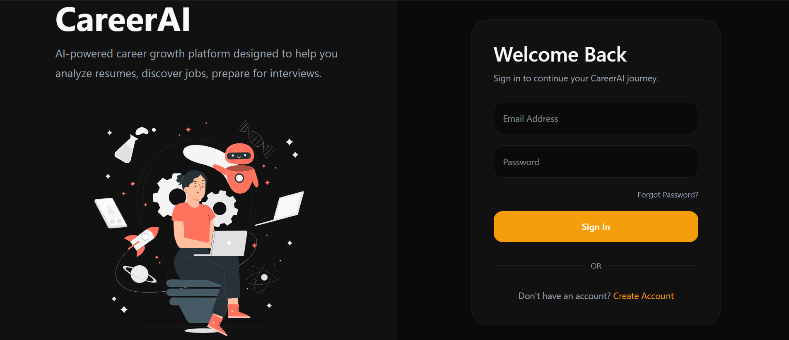
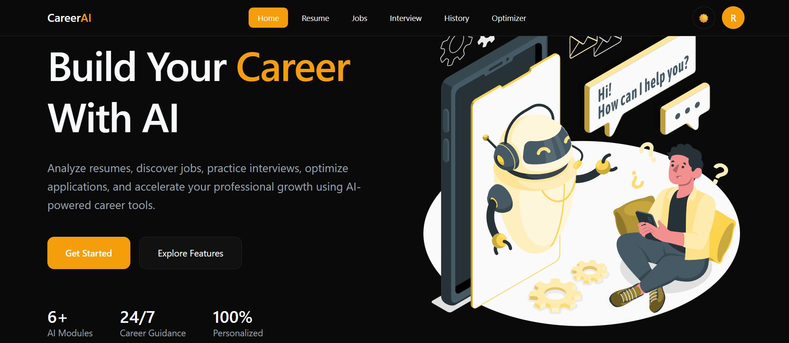
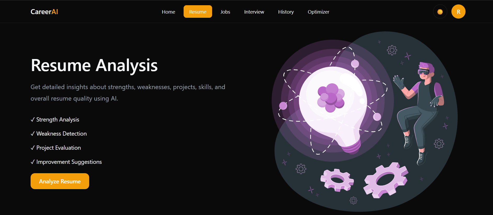
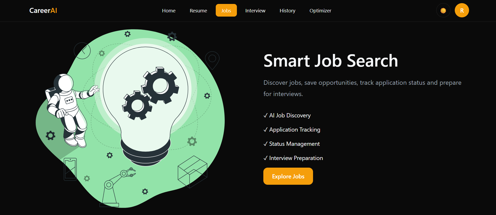
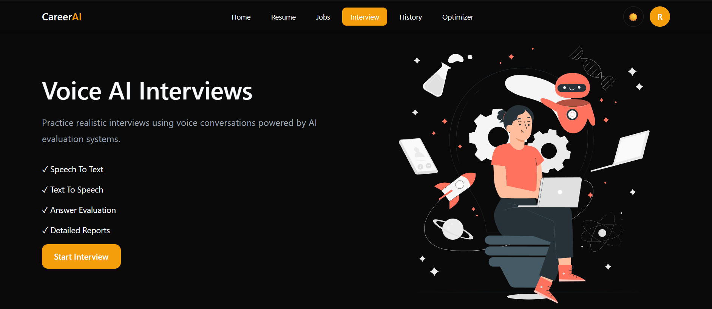
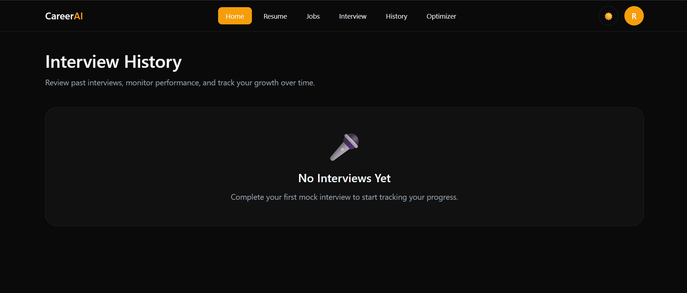

# 🚀 CareerAI Frontend

> AI-Powered Career Development Platform built with React, Redux Toolkit, RTK Query, and Tailwind CSS.

CareerAI helps job seekers improve their resumes, discover relevant opportunities, prepare for interviews, and accelerate their career growth using AI-powered tools.

---

## ✨ Features

### 🔐 Authentication

* User Signup
* User Login
* JWT Authentication
* Protected Routes
* Persistent User Sessions

### 📄 Resume Analysis

* Resume Strength Analysis
* Weakness Detection
* Project Evaluation
* Improvement Suggestions
* AI Resume Chat Assistant

### 💼 Job Discovery

* Browse Jobs
* Job Details View
* AI-Powered Job Recommendations
* Personalized Career Suggestions

### 🎤 AI Mock Interviews

* Interview Setup
* Real-Time Interview Sessions
* Voice Interaction Support
* AI Answer Evaluation
* Detailed Feedback

### 📊 Interview History

* Previous Interview Records
* Performance Tracking
* Score Analysis
* Feedback Review

### 🌙 Modern UI Experience

* Fully Responsive Design
* Light & Dark Mode
* Professional SaaS Layout
* Mobile First Approach
* Theme-Based Design System

---

# 📸 Screenshots

## Login Page




## Landing Page



## Resume Analysis



## Job Recommendations



## AI Interview



## Interview History



---

# 🛠️ Tech Stack

## Frontend

* React.js
* React Router DOM
* Redux Toolkit
* RTK Query
* Tailwind CSS
* Context API

## State Management

* Redux Toolkit
* RTK Query

## Authentication

* JWT Authentication

## API Communication

* REST APIs
* RTK Query

---

# 🏗️ Frontend Architecture

```text
src/
│
├── assets/
│
├── components/
│   ├── Navbar.jsx
│   ├── DashboardCard.jsx
│   ├── jobs/
│   │   └── JobCard.jsx
│   │
│   └── interview/
│       └── VoiceControls.jsx
│
├── pages/
│   ├── Dashboard.jsx
│   ├── Login.jsx
│   ├── Signup.jsx
│   ├── Profile.jsx
│   │
│   ├── jobs/
│   │   ├── Jobs.jsx
│   │   └── JobDetails.jsx
│   │
│   ├── interview/
│   │   ├── InterviewSetup.jsx
│   │   ├── InterviewSession.jsx
│   │   ├── InterviewHistory.jsx
│   │   └── InterviewDetails.jsx
│   │
│   └── resume/
│       └── ResumeAnalysis.jsx
│
├── store/
│   ├── api/
│   └── slices/
│
├── hooks/
│
├── context/
│
└── App.jsx
```

---

# 🎨 Design System

CareerAI follows a centralized theme system using CSS variables.

```css
:root {
  --bg: #ffffff;
  --surface: #f8fafc;
  --text: #111827;
  --secondary: #6b7280;
  --border: #e5e7eb;
  --accent: #f59e0b;
}

.dark {
  --bg: #0a0a0a;
  --surface: #111111;
  --text: #f8fafc;
  --secondary: #9ca3af;
  --border: #222222;
  --accent: #f59e0b;
}
```

### UI Principles

* Responsive First
* Consistent Spacing
* Minimalistic Design
* SaaS Inspired Components
* Accessibility Focused
* Dark & Light Theme Support

---

# ⚙️ Installation

Clone the repository:

```bash
git clone <repository-url>
```

Navigate to project:

```bash
cd careerai-frontend
```

Install dependencies:

```bash
npm install
```

Run development server:

```bash
npm run dev
```

Build for production:

```bash
npm run build
```

Preview production build:

```bash
npm run preview
```

---

# 🌐 Environment Variables

Create a `.env` file in the root directory.

```env
VITE_API_BASE_URL=http://localhost:8000
```

---

# 📱 Responsive Design

CareerAI is optimized for:

* Mobile Devices
* Tablets
* Laptops
* Large Desktop Screens

Every page and component is designed using a mobile-first approach.

---

# 🔮 Upcoming Features

* Resume Optimizer
* Saved Jobs
* Job Application Tracking
* Dashboard Analytics
* Resume Upload Management
* AI Cover Letter Generator
* ATS Score Comparison
* Resume Version Management

---

# 🤝 Contributing

Contributions, suggestions, and improvements are welcome.

1. Fork the repository
2. Create a feature branch
3. Commit your changes
4. Open a Pull Request

---

# 👨‍💻 Author

**Raghuveer Chauhan**

Full Stack Developer | AI Application Developer

Passionate about building AI-powered applications that solve real-world problems and improve user experiences.

---

# ⭐ Support

If you found this project helpful, consider giving it a star.

It helps support future development and motivates continued improvements.

⭐ Star the repository if you like the project.
